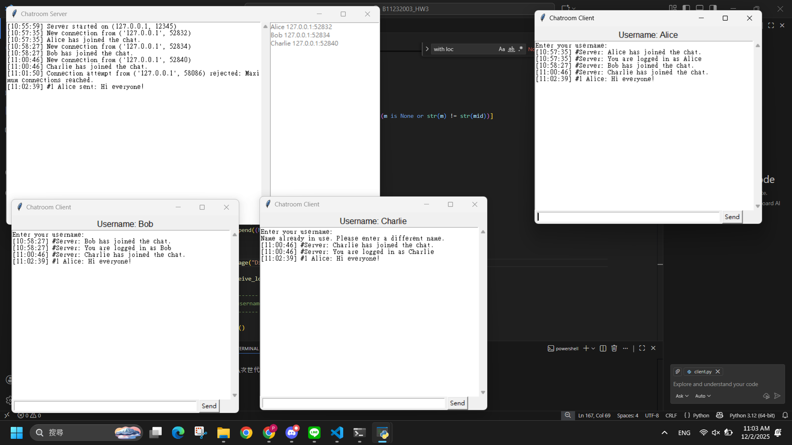

# Multi-threaded TCP GUI Chatroom



## Overview
This project is a multi-threaded client-server chat application developed in Python. It demonstrates foundational concepts of socket programming, concurrency management, and graphical user interface (GUI) synchronization. The system supports a central server managing multiple concurrent clients, enabling real-time global broadcasts, private messaging, and a robust message retraction feature.

## Key Features

* **Multi-threaded Architecture:** The server utilizes Python's `threading` module to allocate dedicated threads for each incoming client connection (`handle_client`), preventing blocking and ensuring high responsiveness.
* **Thread-Safe Operations:** Implemented `threading.Lock()` (Mutex) to protect global message ID counters across multiple threads, preventing race conditions during concurrent message processing.
* **Graphical User Interface (GUI):** Both server and client feature responsive GUIs built with `tkinter`. The client effectively manages cross-thread GUI updates by buffering incoming data and safely refreshing the display.
* **Advanced Chat Capabilities:**
  * **Global Broadcasts:** Standard messages are broadcast to all connected users.
  * **Private Messaging:** Users can send targeted private messages using the `@username` syntax.
  * **Message Retraction (Undo):** Users can retract up to their last three messages. The system handles this gracefully by syncing the `UNDO_ID` across the server and all clients to update their respective GUIs dynamically.

## Engineering Challenges & Solutions

* **GUI Asynchronous Updating:** Initially, direct updates to the `tkinter` text area from background receiving threads caused message overlap and race conditions. This was resolved by implementing a `message_list` buffer and a centralized `gui_refresh()` function to redraw the chat state safely.
* **Precise Message Deletion:** To prevent accidental deletion of messages during retraction, the protocol was enhanced to assign unique, thread-safe `#ID` tags to all messages (including private ones). The server issues a precise `REMOVE_::<ID>` command rather than matching text strings.

## Installation & Usage

1. Clone the repository:
   ```bash
   git clone [https://github.com/YourUsername/Python-TCP-GUI-Chatroom.git](https://github.com/YourUsername/Python-TCP-GUI-Chatroom.git)
   cd Python-TCP-GUI-Chatroom
   ```
2. Start the Server:
   ```Bash
   python server.py
   ```
   The server GUI will appear. Click "啟動伺服器" (Start Server).
3. Start one or multiple Clients:

   ```Bash
   python client.py
   ```
   Enter a unique username when prompted to join the chatroom.
